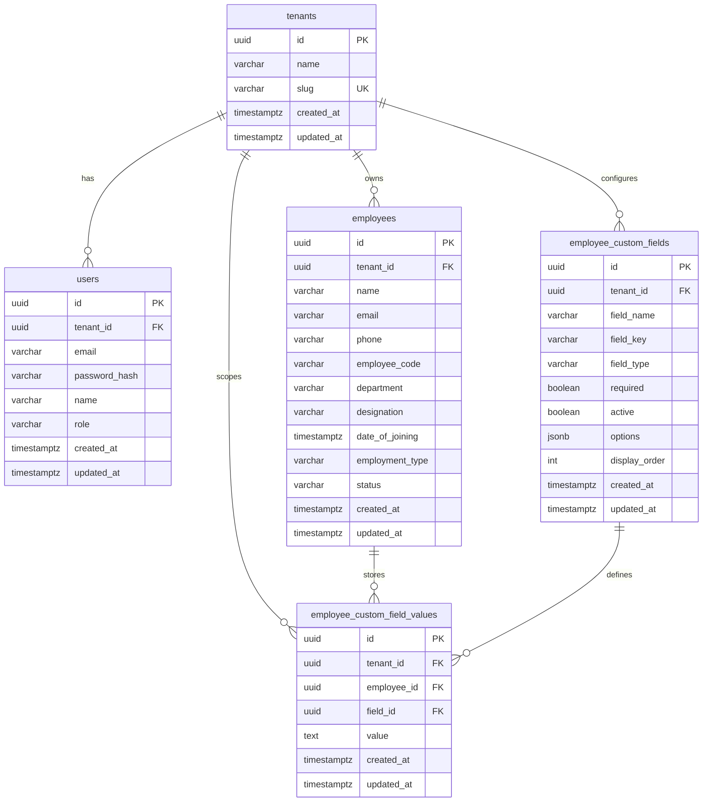

# Database Schema and Migrations

This project creates and updates tables in two ways:

1. `backend/internal/database/database.go` runs `gorm.AutoMigrate(...)` at backend startup.
2. `backend/migrations/001_init.sql` is the reference SQL migration for manual DDL setup.

Both define the same logical schema below.

---

## Migration Inventory

### `001_init.sql`

Path: `backend/migrations/001_init.sql`

Purpose:
- Creates required PostgreSQL extension: `uuid-ossp`
- Creates all core tables
- Adds unique constraints and indexes for tenant-scoped data

---

## ER Diagram



---

## Table Definitions

### `tenants`
- `id uuid primary key`
- `name varchar(200) not null`
- `slug varchar(100) not null unique`
- `created_at timestamptz not null default now()`
- `updated_at timestamptz not null default now()`

### `users`
- `id uuid primary key`
- `tenant_id uuid not null references tenants(id)`
- `email varchar(255) not null`
- `password_hash varchar(255) not null`
- `name varchar(200) not null`
- `role varchar(20) not null`
- `created_at timestamptz not null default now()`
- `updated_at timestamptz not null default now()`
- Unique: `(tenant_id, email)`
- Index: `idx_users_tenant (tenant_id)`

### `employee_custom_fields`
- `id uuid primary key`
- `tenant_id uuid not null references tenants(id)`
- `field_name varchar(200) not null`
- `field_key varchar(100) not null`
- `field_type varchar(20) not null`
- `required boolean not null default false`
- `active boolean not null default true`
- `options jsonb`
- `display_order int not null default 0`
- `created_at timestamptz not null default now()`
- `updated_at timestamptz not null default now()`
- Unique: `(tenant_id, field_key)`
- Index: `idx_fields_tenant (tenant_id)`

### `employees`
- `id uuid primary key`
- `tenant_id uuid not null references tenants(id)`
- `name varchar(200) not null`
- `email varchar(255) not null`
- `phone varchar(30)`
- `employee_code varchar(50) not null`
- `department varchar(100)`
- `designation varchar(100)`
- `date_of_joining timestamptz`
- `employment_type varchar(50)`
- `status varchar(30) not null default 'ACTIVE'`
- `created_at timestamptz not null default now()`
- `updated_at timestamptz not null default now()`
- Unique: `(tenant_id, email)`
- Unique: `(tenant_id, employee_code)`
- Index: `idx_emp_tenant (tenant_id)`

### `employee_custom_field_values`
- `id uuid primary key`
- `tenant_id uuid not null references tenants(id)`
- `employee_id uuid not null references employees(id) on delete cascade`
- `field_id uuid not null references employee_custom_fields(id)`
- `value text`
- `created_at timestamptz not null default now()`
- `updated_at timestamptz not null default now()`
- Unique: `(employee_id, field_id)`
- Index: `idx_ecfv_tenant (tenant_id)`
- Index: `idx_ecfv_employee (employee_id)`

---

## Manual SQL Migration

If you want to apply the schema manually instead of relying on `AutoMigrate`, run:

```bash
psql "$DATABASE_URL" -f backend/migrations/001_init.sql
```

In this codebase, backend startup still executes `AutoMigrate` and keeps the schema aligned with model definitions.
